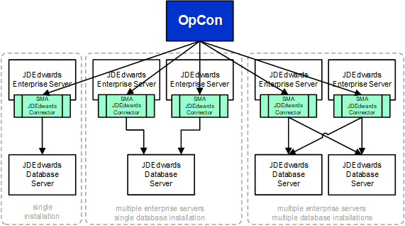
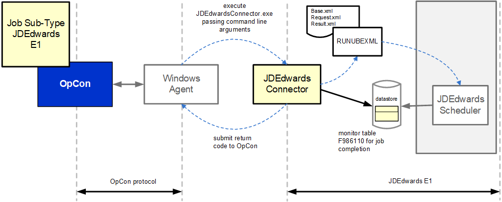

# JDEdwards Connector

The JDEdwards Connector interacts with the scheduler within the JDEdwards environment to start reports and track the completion of the started report. This allows the 
report execution within JDEdwards to be integrated within OpCon workflows.

The report definition remains within JDEdwards and the JDEdwards job subtype defines the information required to identify the report with the JDEdwards environment.

The JDEdwards environment supports multiple servers (Enterprise, Database, Web and Deployment) and the JDEdwards Connector interacts with the Enterprise Servers to 
start the report and the Database servers to monitor the status of the started report. Each Enterprise server that requires OpCon to start reports, must have a 
JDEdwards Connector installation.

The Overview shows various implementations from single Enterprise Server and Database Server to multiple Enterprise Servers and Database Servers. In all cases a single 
OpCon instance can be used to start reports across the various environments.

The reason that the JDEdwards Connector is required on each Enterprise Server is that the connector use the RUNUBEXML utility to start the report within the JDEdwards 
environment. This utility returns the unique job id in the result XML file which is then used to track the status of the report in the database. The connector creates 
the necessary XML files using the information provided in the JDEdwards E1 job subtype.

The current connector implementation consists of a Windows batch program that is executed by the Windows Agent (see figure 1). The job definitions are entered as Windows 
jobs using the JDEdwards E1 job subtype. When the job is scheduled by OpCon, the definitions are passed as arguments to the JDEdwards Connector.

The JDEdwards Connector currently supports a single job type which is used to define the report information. The definitions are passed to the JDEdwards Connector as arguments. 
These values are used when creating the initial base.XML file which is then submitted to the JDEdwards environment using the RUNUBEXML utility. The RUNUBEXML utility returns a 
request.XML which is parsed by the JDEdwards Connector updating the JOBQUEUE parameter if this has been received as an argument. The request.XML is then submitted to the JDEdwards 
environment using the RUNUBEXML utility. The RUNUBEXML utility returns a result.XML which the JDEConnector parses to extract the report jobid. The jobid and the JDEdwards execution 
values are used to track the status of the report in the F986110 table of the JDEdwards database.

If the job returns an error condition, the output of the jde and jdedebug.logs are appended to the OpCon job log and can be retrieved using the JORS capability. Using this functionality 
with the OpCon Event Notification System allows an email to be submitted to a defined address (or group address) with the attached OpCon job output if the report fails.

---