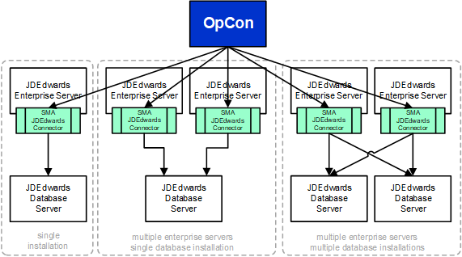
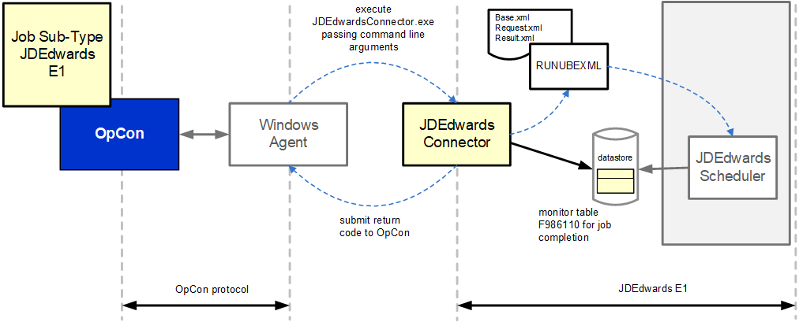

# JDEdwards Connector overview

The JDEdwards Connector integrates the JDEdwards scheduler with OpCon workflows. It starts reports within JDEdwards and monitors their completion status, allowing report execution to be managed as part of an OpCon automation workflow while the report definitions remain in JDEdwards.

## What is it?

The JDEdwards Connector is a Windows batch program that runs on a JDEdwards Enterprise Server. OpCon schedules the connector as a Windows job using the JDEdwards E1 job subtype, passing report definitions as arguments. The connector communicates with the JDEdwards environment to submit reports and with the JDEdwards database to track their status.

Use the JDEdwards Connector when you need to:

- Schedule JDEdwards report runs as part of an OpCon workflow
- Monitor the completion status of JDEdwards reports from OpCon
- Manage report execution across multiple JDEdwards Enterprise Servers from a single OpCon instance
- Integrate JDEdwards report failures with OpCon event notifications and email alerts

## Architecture

The JDEdwards environment supports multiple server types — Enterprise, Database, Web, and Deployment. The connector interacts with Enterprise Servers to start reports and with Database Servers to monitor report status.

Each Enterprise Server that requires OpCon to start reports must have a JDEdwards Connector installation. A single OpCon instance can manage reports across multiple Enterprise Servers and Database Server environments.

## How the connector works

When OpCon schedules a JDEdwards E1 job, it passes the report definition as arguments to the connector. The connector uses the RUNUBEXML utility on the Enterprise Server to submit the report.

The process follows these steps:

1. The connector creates a base XML file from the job definition arguments
2. The connector submits the base XML to RUNUBEXML, which returns a request XML file
3. The connector submits the request XML to RUNUBEXML, which returns a result XML file
4. The connector parses the result XML to extract the unique report job ID
5. The connector queries the F986110 table in the JDEdwards database at regular intervals to monitor the report status until it completes

## Error handling

When a report completes with an error, the connector appends the JDEdwards `jde.log` and `jdedebug.log` files to the OpCon job output. You can retrieve this combined output using the OpCon Job Output Retrieval System (JORS). When configured with the OpCon Event Notification System, failed report output can be automatically emailed to a defined address or group address.

## FAQs

**Does the connector create new job definitions in JDEdwards?**
No. The connector only uses existing job definitions. The report definition must already exist in the JDEdwards environment before it can be scheduled through OpCon.

**Can one OpCon instance manage reports on multiple Enterprise Servers?**
Yes. A single OpCon instance can start reports across multiple JDEdwards Enterprise Server environments. Each Enterprise Server requires its own connector installation, and multiple database connections can be defined in the Connector.config file.

**What databases does the connector support?**
The connector supports SQL Server and Oracle databases for status monitoring through the F986110 table.

**What happens when a JDEdwards report fails?**
When a report fails, the connector appends the `jde.log` and `jdedebug.log` output to the OpCon job output. You can retrieve this through JORS and configure the Event Notification System to send the output as an email attachment.

**Why does each Enterprise Server need its own connector installation?**
The connector uses the RUNUBEXML utility to start reports. This utility must run on the same Enterprise Server where the report will execute, so a connector installation is required on each server that will run reports through OpCon.

## Glossary

**Enterprise Server** — The JDEdwards server where reports are submitted for processing. The JDEdwards Connector must be installed on each Enterprise Server that runs reports through OpCon.

**Database Server** — The JDEdwards server hosting the database that the connector queries to monitor report status via the F986110 table.

**F986110** — The JDEdwards database table that stores report job status information. The connector queries this table to determine whether a submitted report has completed, is processing, or has errored.

**RUNUBEXML** — A JDEdwards command-line utility that the connector uses to submit reports. The connector creates XML files and passes them to RUNUBEXML to start a report and retrieve the assigned job ID.

**JDEdwards E1 job subtype** — The OpCon job subtype used to define a JDEdwards report job. Selected within a Windows job type in Enterprise Manager, it provides the fields needed to identify and submit a report through the connector.

**Related topics:**

- [Installation](./installation.md)
- [Operation](./operation.md)
